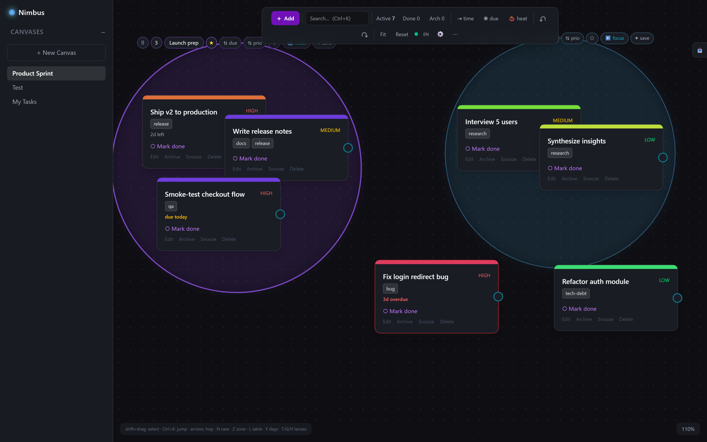
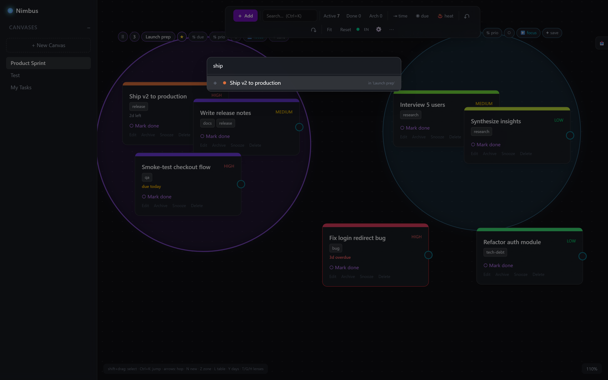
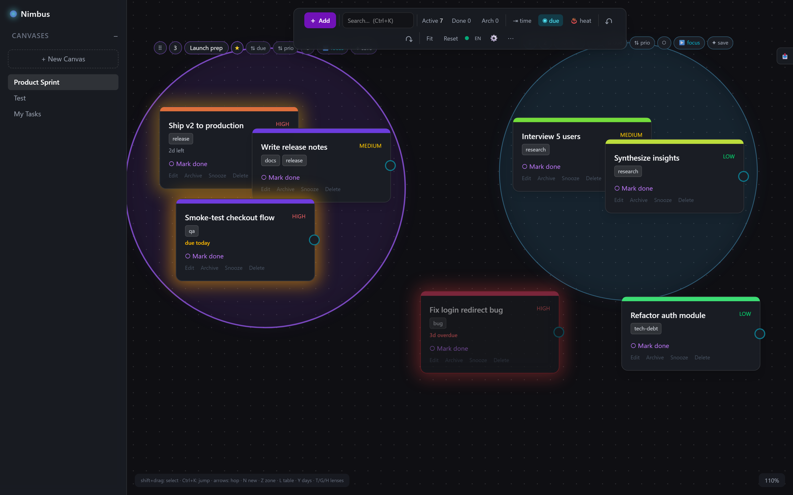
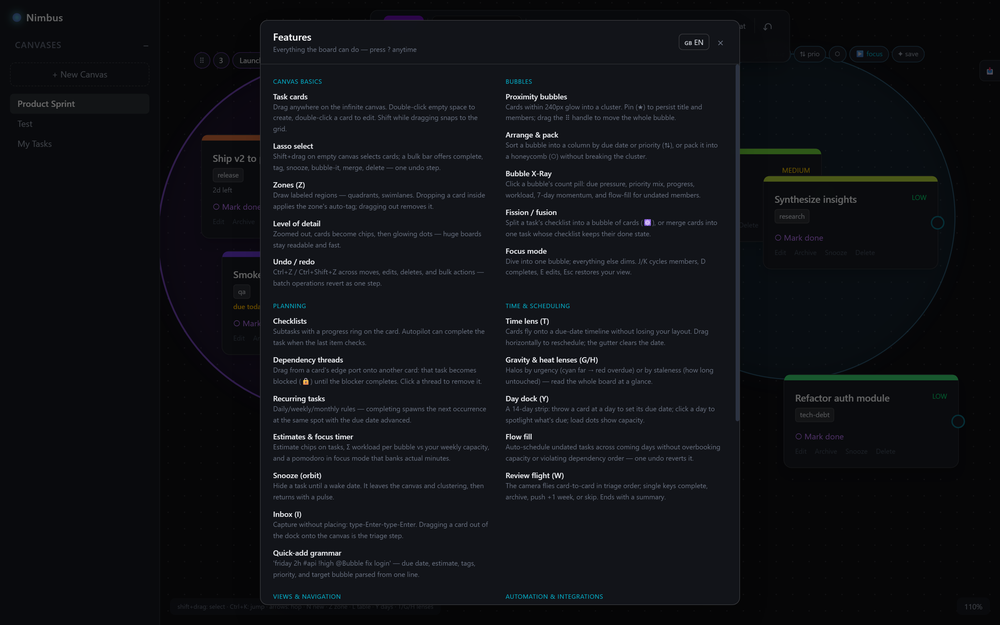

# Nimbus

**A spatial task-planning whiteboard where tasks cluster into glowing bubbles.**

Nimbus is an infinite pan/zoom canvas for planning work spatially. Drop task cards anywhere; cards that drift near each other **coalesce into glowing clusters** ("bubbles") you can name, pin, arrange, and act on as a unit. It's a full local-first app — React + Vite frontend, Express + Prisma + PostgreSQL backend — with real-time multi-window sync, an undo history, keyboard-driven navigation, GitHub-issue sync, and English/German localization.



## Highlights

Press **`?`** anywhere in the app for the full, searchable feature catalog. A taste:

- **Proximity bubbles** — cards within 240px glow into a cluster; pin one (★) to persist its title and members, or drag the whole bubble by its handle.
- **Spatial planning** — draw labeled **zones** that auto-tag cards dropped inside, wire **dependency threads** between cards (blocked tasks lock until their blocker is done), split a task's checklist into a bubble of cards or merge cards back into one.
- **Time & scheduling** — a **time lens** projects cards onto a due-date timeline without disturbing your layout; **flow-fill** auto-schedules undated tasks across coming days respecting capacity and dependencies; a **day dock** lets you throw a card at a day to schedule it.
- **Navigation** — a **command palette** (Ctrl+K) that flies the camera to any task/bubble/canvas, arrow-key hopping between cards, camera **waypoints** (Shift+1–9), a minimap, and a level-of-detail view that keeps huge boards fast.
- **Insight** — deadline-gravity and staleness **lenses**, a **pulse** panel (burndown/velocity/churn), per-bubble **X-ray** stats, and a **time-lapse** replay of the board's history.
- **Automation & integrations** — bidirectional **GitHub-issue sync** (status columns, comments, live updates), real-time **live sync** across windows, read-only **share links**, an **ICS calendar feed**, a **capture URL**, and Markdown/CSV/JSON export.
- **Bilingual** — full **English & German** UI, switchable at runtime.

### Command palette — jump anywhere

Fuzzy-search across tasks, bubbles, canvases, and actions; the camera flies to what you pick. Type `n …` to quick-add with grammar (`friday 2h #api !high @Bubble fix login`).



### Lenses — read the whole board at a glance

The deadline-gravity lens wraps each card in a halo by urgency (cyan far → red overdue); the staleness lens colors by how long a card has gone untouched.



### Everything, in one place

The in-app **Features** panel (`?`) documents every capability with a one-line description.



## Tech stack

| Layer | Stack |
|---|---|
| Frontend | React 19, Vite, TypeScript, Tailwind CSS v4, Zustand, Framer Motion, Zod |
| Backend | Express 5 (tsx runner), Prisma 6 |
| Database | PostgreSQL 16 (Docker) |
| Realtime | Server-Sent Events (per-canvas event bus) |

## Getting started

**Prerequisites:** Node.js, Docker (for PostgreSQL).

```bash
# 1. Install workspace dependencies
npm install

# 2. Configure the server env, then start PostgreSQL
cp server/.env.sample server/.env
docker compose up -d db

# 3. Apply the schema and seed a demo board
cd server && npx prisma migrate deploy && npm run seed && cd ..

# 4. Run the app (two terminals)
cd server   && npm run dev     # API on http://localhost:8085
cd frontend && npm run dev     # UI  on http://localhost:5173
```

Open **http://localhost:5173**. The frontend proxies `/api/*` to the backend, so you only browse the one URL.

**Optional — GitHub sync:** put a fine-grained personal access token in `server/.env` as `GITHUB_TOKEN=…`, then add a connection from the toolbar's **⋯ → Connections** menu.

For architecture details, conventions, and the (non-interactive) migration workflow, see [`CLAUDE.md`](CLAUDE.md).

## Internationalization

The entire UI is available in English and German, switchable at runtime (toolbar language toggle or the Features panel). Dates and relative times localize too.


